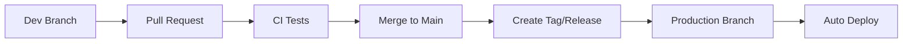

# 🚀 Production Deployment Strategy

## 🎯 Mục tiêu
Đảm bảo việc deploy production an toàn, tránh lỗi từ code development chưa được test kỹ.

## 📋 Workflow

### 1. Development → Staging → Production



### 2. Branch Strategy

| Branch | Mục đích | Auto-deploy |
|--------|----------|-------------|
| `main` | Development code | ❌ |
| `production` | Stable production code | ✅ |
| `v*` tags | Release versions | ✅ |

### 3. Safe Update Process

#### ✅ An toàn:
- Chỉ update từ `production` branch hoặc version tags
- Chạy health check trước và sau update
- Tự động rollback nếu thất bại
- Backup trước khi update

#### ❌ Không an toàn:
- Update trực tiếp từ `main` branch
- Không có health check
- Không có rollback plan

## 🔧 Cách sử dụng

### Bước 1: Thiết lập GitHub Actions
- File `.github/workflows/production-deploy.yml` đã được tạo
- Sẽ tự động tạo `production` branch khi có tag mới

### Bước 2: Tạo release
```bash
# Trên máy dev
git tag -a v1.0.1 -m "Release version 1.0.1"
git push origin v1.0.1
```

### Bước 3: Production sẽ tự động update
- Script `safe-update.bat` sẽ chạy mỗi 15 phút
- Chỉ update khi có version mới trên `production` branch

## 🛡️ Safety Features

### Pre-update Checks:
- ✅ Docker đang chạy
- ✅ Đủ disk space
- ✅ File cấu hình tồn tại
- ✅ Network connectivity

### Post-update Checks:
- ✅ Application health check
- ✅ HTTP response 200
- ✅ Services running
- ✅ No error logs

### Rollback Conditions:
- ❌ Build failed
- ❌ Health check failed
- ❌ Services not starting
- ❌ HTTP errors

## 📊 Monitoring

### Logs Location:
- `logs/auto-update.log` - Update history
- `docker-compose logs` - Application logs

### Health Check:
- URL: `http://[IP]:8080/api/health`
- Expected: HTTP 200
- Timeout: 60 seconds

## 🔄 Manual Operations

### Kiểm tra trạng thái:
```bash
scripts/manage-autoupdate.bat
```

### Update thủ công:
```bash
scripts/safe-update.bat
```

### Rollback thủ công:
```bash
git stash pop
docker-compose restart
```

## 🚨 Emergency Procedures

### Nếu update thất bại:
1. Kiểm tra logs: `type logs\auto-update.log`
2. Kiểm tra Docker: `docker-compose ps`
3. Rollback: `git stash pop && docker-compose restart`
4. Liên hệ dev team

### Nếu cần disable auto-update:
```bash
schtasks /change /tn "VoucherManager_AutoUpdate" /disable
```

## 📝 Best Practices

### Cho Dev Team:
1. ✅ Test kỹ trước khi tạo tag
2. ✅ Sử dụng semantic versioning (v1.0.1)
3. ✅ Viết changelog rõ ràng
4. ✅ Test trên staging trước

### Cho Production:
1. ✅ Monitor logs thường xuyên
2. ✅ Backup database định kỳ
3. ✅ Kiểm tra disk space
4. ✅ Update OS security patches

## 🔗 Related Files

- `scripts/safe-update.bat` - Main update script
- `scripts/manage-autoupdate.bat` - Management interface
- `scripts/environment-check.bat` - Environment validation
- `.github/workflows/production-deploy.yml` - CI/CD pipeline
- `auto-update.config` - Configuration file